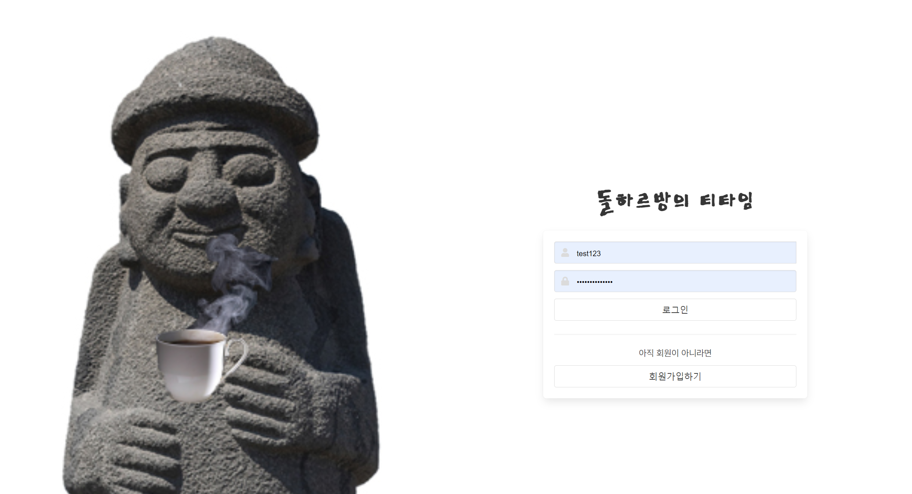
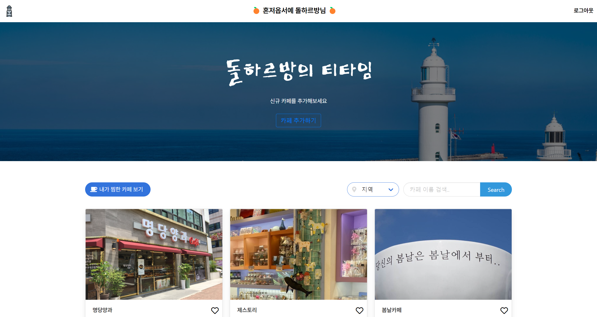
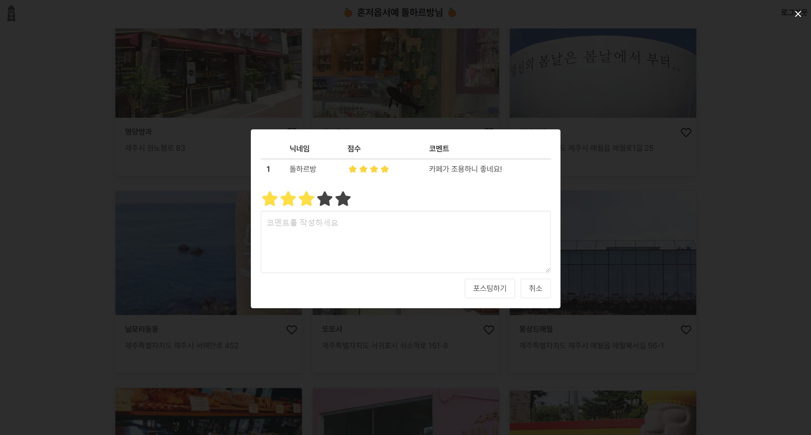

<!--Heading-->

## 1. 돌하르방의 티타임☕

- 제주도에 여행을 갔을 때, 카페가 너무 많아서 파악하기 어려운 경우가 많았습니다.  돌하르방의 티타임을 사용하여 자신이 위치한 지역에 어떠한 카페가 있는지 검색하고, 자신이 원하는 카페가 어디에 위치해 있으며, 사람들의 평은 어떠한지 확인 해 볼 수 있습니다. 또한 자신이 궁금한 카페를 검색할 수 있으며 관심있는 카페를 찜하여 따로 목록을 만들 수 있습니다.

---

## 2. 사용 기술

- Flask (2.0.2)
- Pymongo (4.0.1)
- Pyjwt (2.3.0)
- jinja2 (3.0.3)
- requests (2.26.0)
- AWS EC2 (Ubuntu 18.04 LTS)
- JQuery
- Bulma

---

## 3. 실행화면

- 사용자가 로그인 할 수 있는 페이지입니다. 

<!---->
- 아이디와 비밀번호가 없다면 회원가입을 통하여 계정을 만들 수 있습니다. 

<!---->
- 로그인 완료 후 보여지는 메인 페이지 입니다.

<!---->
- 카페 클릭시 카페별로 분류화된 commnet들을 불러오며 사용자가 직접 comment를 포스팅 할 수 있습니다.

---

## 4. 핵심기능

- 로그인, 회원가입
  - JWT를 이용하여 로그인과 회원가입을 구현하였습니다.
  - 아이디, 비밀번호의 중복확인 가능합니다. 
<!---->
- 사용자에 따른 개별 서비스 이용 가능
  - Jinja2를 이용하여 Main page 상단에 각 user nickname을 노출하였습니다.
<!---->
- 카페 검색
  - 제주시, 제주동부, 서귀포시, 제주서부 중 한 지역을 선택하면  나누어 각 위치에 맞는 카페 검색이 가능합니다.
  - 카페명 정확히 입력하였을 시 검색 가능합니다.
<!---->
- 내가 좋아하는 카페 저장 후 목록 관리하기
  - 찜하기 button을 사용하여 카페이름을 받아와 mongodb에서 해당 카페의 정보를 불러온 후 카드 형식으로 사용자에게 보여지게 됩니다.
<!---->
- 내가 좋아하는 카페 공유하기
  - Posting Box를 활용하여 사용자가 직접 카페를 추가할 수 있습니다.
  - Ajax를 통하여 클라이언트로 부터 값을 가져와 DB로 전달하여 db에서 가공 후 다시 Client에 Card 형식으로 보여주게 됩니다.
<!---->
- 카페 별 댓글 입력 및 조회 가능.
  - 카페별로 분류하여 comments를 가져오고 로그인 한 사용자가 카페 이용 후 느낀 내용을 별점과 함께 포스팅 가능합니다.
  - 다른 사용자가 남긴 댓글들을 카페별로 확인 할 수 있습니다.
